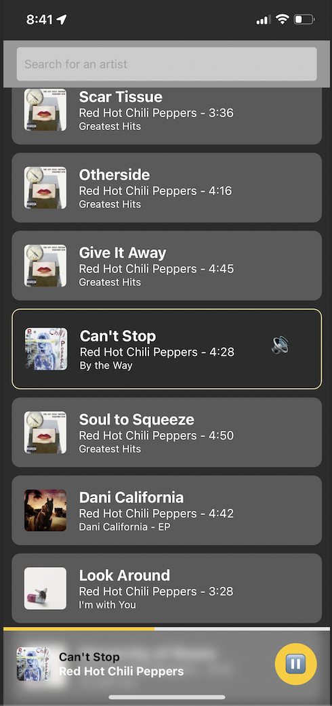
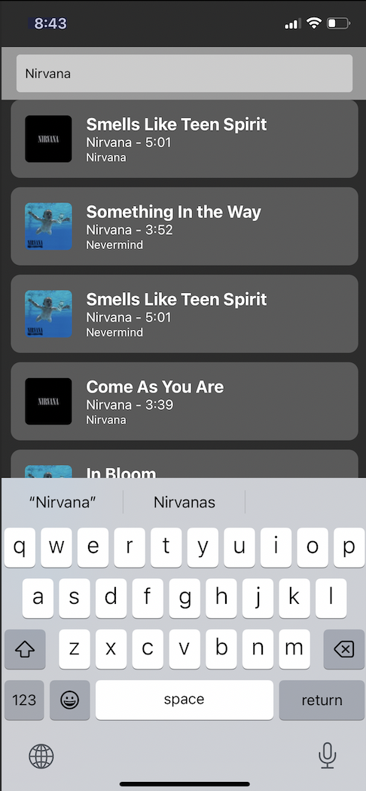

[](https://github.com/mikecamara/mooosic/actions/workflows/ci_cd.yml)

# Mooosic 🐄🎵

A simple and cowsome music player app that allows users to search for their favorite artists using the iTunes Search API. Built with React Native and Expo.

<table style="border-collapse: collapse; border: 0;">
  <tr>
    <td style="width: 45%; padding-right: 10px; border: none;">
      
    </td>
    <td style="width: 45%; padding-left: 10px; border: none;">
      
    </td>
  </tr>
</table>

## Features

- Search for artists by name
- Displays song title, artist, album, and album art
- Media player with play/pause functionality
- Portrait mode layout
- Built using React Native and Expo

## Prerequisites

- Node.js v12 or higher
- npm or yarn
- Expo CLI

## Installation and Setup

1. Clone this repository:

```
git clone https://github.com/mikecamara/mooosic.git
cd mooosic
```

2. Install dependencies:

```
npm install
```

or

```
yarn
```

3. Start the development server:

```
expo start
```

4. Follow the instructions in the Expo CLI to run the app on your device or emulator. You can also use the Expo Go app on your phone by scanning the QR code displayed in the CLI or browser window.

## Usage

1. Enter an artist's name in the search bar and tap the search button.
2. Browse the list of songs returned by the search.
3. Tap a song to start playing it. The media player will appear at the bottom of the screen.
4. Use the play/pause button to control playback.

## Testing

To run the unit tests

```
npm run test
```

To generate test coverage report:

```
npm run coverage
```

## Deployment

You can also use [Fastlane](https://docs.fastlane.tools/) for automated deployment. Navigate to the iOS/Android folder and enter:

```
fastlane init
fastlane release
```

Before using Fastlane, ensure that you have resolved any certifications and sign in issues with iOS/Android developer accounts.

## Documentation

To generate documentation using better-docs, first install the npm package:

```
npm install better-docs
npm run docs
```

After generating the documentation, uninstall the better-docs package to avoid conflicts with the latest React version.

## Known Issues and Limitations

- When a song ends, the app does not automatically play the next song.
- No advanced media controls (seeking, skipping, or volume control) are implemented.
- After a song is stopped, you cannot restart the same song.
- Test coverage needs more work.
- Certifications and sign-in issues with iOS/Android developer accounts need to be fixed to enable Fastlane to automatically deploy the app to the store.
- End-to-end tests with Detox need to be added.
- Integration tests need to be added.
- Documentation generation with typecript better-docs has deprecated npm packages.
- There are some Expo Go warnings regarding possible unhandled promises that must be dealt with.

## Contributing

Please feel free to submit issues or pull requests with any bug fixes, improvements, or new features. Adhere to the project's coding standards and include tests for any new functionality.

## Best Practices and Software Engineering Techniques

Throughout the development of Mooosic, we have applied various software engineering best practices to ensure high-quality code, maintainability, and efficient development processes. Some of the key practices used include:

### Test-Driven Development (TDD)

TDD was utilized to create a robust, reliable, and well-tested application. By writing tests before implementing functionality, we were able to define clear expectations for each component's behavior and iteratively refine the code to meet those expectations.

### Trunk Based Development

A trunk-based development Git strategy was employed to keep the codebase clean and minimize merge conflicts. This approach involved committing directly to the main branch or using short-lived feature branches, which were frequently merged back into the main branch. This practice facilitated continuous integration and faster delivery of new features and bug fixes.

### Continuous Integration and Continuous Deployment (CI/CD)

CI/CD was implemented using GitHub Actions, which allowed us to automate the build, test, and deployment processes. By automatically testing and deploying each change, we ensured that the application remained stable and ready for production at all times.

### Automatic Deployment with Fastlane

Fastlane was used to automate the deployment of the app to the app stores, streamlining the release process and reducing manual efforts. This enabled us to rapidly deliver new features and improvements to users.

### Requirement Analysis and Documentation

Before diving into the code, we carefully analyzed the project requirements and began creating documentation. This allowed us to develop a clear understanding of the application's objectives and the necessary components to fulfill those objectives.

To effectively manage the project and ensure timely delivery, we broke down the tasks into smaller, manageable subtasks and assigned time estimates to each. This approach helped us stay organized and on track throughout the development process.

[See project requirements](./requirements/)

## License

This project is licensed under the [MIT License](LICENSE).

## Acknowledgments

- Special thanks to the iTunes Search API for providing the music data.
- Inspired by the love for cows and music 🐄🎵.
